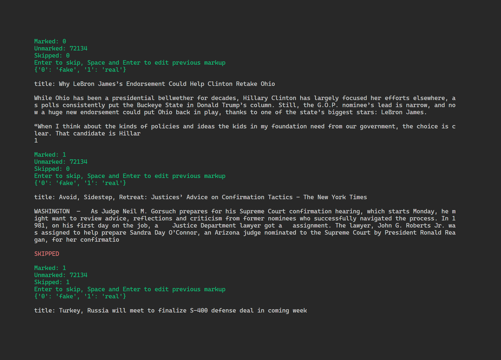

# theme
Simple CLI labeling tool for text classification

It allows to rapidly acquire manually labeled texts without the need to setup any large-scale labeling solution.

With the least requirements possible one can get an initial dataset to train text classification model.

## Installation
```bash
pip install theme-label
```

## Usage
To use `theme` you will need:
- .csv table with at least *two* columns: the one with texts and their id's
- The following script

```python
from theme import Theme

# This is the dict that maps
# what user enters to what goes
# to the table
id2label = {
    '0': 'ham',
    '1': 'spam'
}

# Here markup session is initialized
# data is loaded and everything prepared
t = Theme(
    id2label=id2label,
    text_col='text', # Name of the column with texts
    show_cols=['title'], # Additional fields to show during labeling
    unmarked_table='data.csv', # Our input table
    marked_table='markup.csv', # Output table will have same columns with additional one for label
    label_col='label', # The name of additional column
    id_col='id', # The name of id column
    select_label=None # If you already have labels in label_col and want to relabel some label
)

# Here labeling session is run
t.run()
```

## Labeling process


The info on number of already marked, unmarked and skipped presented to the user first. Then the available options are printed - which input stands for which class.

Finally there are some additional user-defined fields and the text to label. The user is prompted to choose the label.

If entered label is *empty*, then the text is marked as skipped and will not appear in this session.  
If entered label is *space*, then the previous markedtext is prompted instread of current one.  
If the label is not in the `id2label` the user is prompted to enter the label again.
